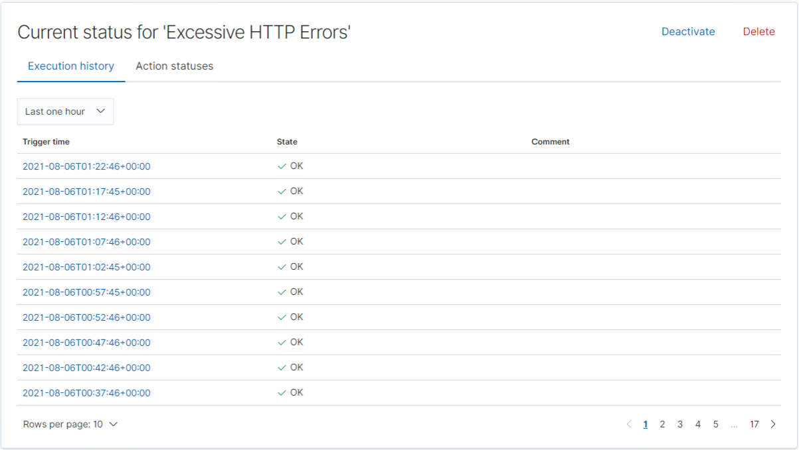

# Blue Team: Summary of Operations

## Table of Contents
- Network Topology
- Description of Targets
- Monitoring the Targets
- Patterns of Traffic & Behavior
- Suggestions for Going Further

### Network Topology

The following machines were identified on the network:

| Name            	| IP Address     	| Operating System   	| Purpose                                       	|
|-----------------	|----------------	|--------------------	|-----------------------------------------------	|
| HYPER-V Manager 	| 192.168.1.0/24 	| Windows 10         	| Azure Hyper-V Machine hosting Virtual Network 	|
| Kali Linux      	| 192.168.1.90   	| Debian Kali 5.4.0  	| Red Team Penetration Testing Machine          	|
| ELK Stack       	| 192.168.1.100  	| Ubuntu 18.04       	| ELK Stack (Elastisearch and Kibana)           	|
| Capstone        	| 192.168.1.105  	| Ubuntu 18.04       	| Vulnerable Web Server                         	|
| Target 1        	| 192.168.1.110  	| Debian GNU/Linux 8 	| WordPress Host                                	|
| Target 2        	| 192.168.1.115  	| Debian GNU/Linux 8 	| WordPress Host                                	|

---

### Description of Targets

The targets of this attack were: `Target 1` (192.168.1.110) and `Target 2` (192.168.1.115).

Both Targets expose the same WordPress site, however Target 2 has better security hardening.

Targets 1 and 2 are Apache web servers and have SSH enabled, so ports 80 and 22 are possible ports of entry for attackers. As such, the following alerts have been implemented.

### Monitoring the Targets

Traffic to these services should be carefully monitored. To this end, we have implemented the alerts below:

#### **Alert 1: Excessive HTTP Errors**
`WHEN count() GROUPED OVER top 5 'http.response.status_code' IS ABOVE 400 FOR THE LAST 5 minutes`

Alert 1 is implemented as follows:
  - **Metric**: Count grouped over top 5 ‘http.response.status_code’
  - **Threshold**: Above 400 in 5-minute period
  - **Vulnerability Mitigated**: Enumeration/Brute Force
  - **Reliability**: This alert is highly reliable. Measuring by error codes 400 and above will filter out any normal or successful responses. 400+ codes are client and server errors which are of more concern.

#### **Alert 2: HTTP Request Size Monitor**
`WHEN sum() of http.request.bytes OVER all documents IS ABOVE 3500 FOR THE LAST 1 minute`
Alert 2 is implemented as follows:
  - **Metric**: Sum of http.request.bytes over all documents
  - **Threshold**: Above 3500 in 1-minute period
  - **Vulnerability Mitigated**: Code injection in HTTP requests (XSS and CRLF) or DDOS
  - **Reliability**: Alert could create false positives. It comes in at a medium reliability. There is a possibility for a large non malicious HTTP request or legitimate HTTP traffic.

#### **Alert 3: CPU Usage Monitor**
`WHEN max() OF system.process.cpu.total.pct OVER all documents IS ABOVE 0.5 FOR THE LAST 5 minutes`
Alert 3 is implemented as follows:
  - **Metric**: Max of system.process.cpu.total.pct over all documents
  - **Threshold**: Above 0.5 in 5-minute period
  - **Vulnerability Mitigated**: Malicious software, programs (malware or viruses) running taking up resources
  - **Reliability**: The alert is highly reliable. Even if there isn’t a malicious program running this can still help determine where to improve on CPU usage.

### Suggestions for Going Further
- Each alert above pertains to a specific vulnerability/exploit. Alerts only detect malicious behavior, but do not stop it. For each vulnerability/exploit identified by the alerts above, a patch has been recommended.

The logs and alerts generated during the assessment suggest that this network is susceptible to several active threats, identified by the alerts above. In addition to watching for occurrences of such threats, the network should be hardened against them. The Blue Team suggests that IT implement the fixes below to protect the network:

- Enumeration and Brute Force Attacks
  - **Patch**: WordPress Hardening
    - Lock out accounts after a number of failed attempts and implement multi-factor authentication (MFA).
    - Disable the WordPress REST API and XML-RPC if it’s not needed and configure the web server to block requests to /?author=<number>.
    - Prohibit exposure of /wp-admin and /wp-login.php.

  - **Why It Works**:
    - Account lock outs will mitigate credential stuffing and multi-factor authentication will mitigate password spraying attacks.
    - WPScan uses REST API to enumerate users, and XML-RPC uses HTTP as its transport mechanism for data.
    - WordPress permalinks can be set to include an author and preventing exposure of WordPress login portals will help mitigate brute force attacks.

- Code Injection in HTTP Requests (XSS and CRLF) and DDOS
  - **Patch**: Code Injection/DDOS Hardening
    - Implementation of HTTP Request Limit on the web server.
    - Implementation of server-side input validation to prevent malicious scripts from being stored on the web server.
    - Implementation of client-side input validation to prevent input of malicious scripts.

  - **Why It Works**:
    - If an HTTP request URL length, query string and over size limit of the request a 404 range of errors will occur.
    - Input validation can help protect against malicious data a malicious actor attempts to send to the server via the website or application in a HTTP request.

- Malicious Code (Malware and Viruses) and Resource Utilization
  - **Patch**: Malware Hardening
    - Implementation of Antivirus software
    - Implementation of a Host Based Intrusion Detection System (HIDS)

  - **Why It Works**:
    - Antiviruse software is effective in detection and removal of of malicious threats against computers and a robust security option in general which should be layered into a Defense in Depth approach to Cyber Security.
    - Host Based Intrusion Detection Systems monitor and analyze the entire file system of a host system and generate alerts if baseline deviation is detected.