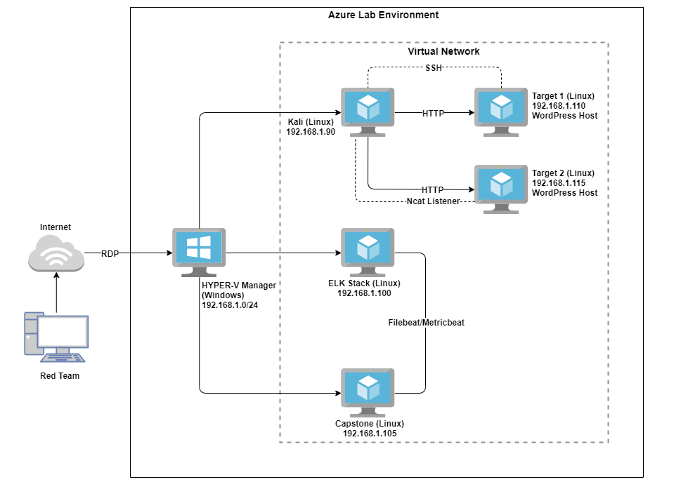

# Red vs Blue Team

This document contains the following details:
- Description of Project
  - Summary of Engagement
  - [Defensive Security Summary](DefensiveSummary.md)
  - [Offensive Security Summary](OffensiveSummary.md)
  - [Network Forensics Summary](NetworkSummary.md)
- Tools and Technologies
  - Blue Team: Monitoring Tools
  - Red Team: Tactics, Techniques, and Procedures
  - Network Forensic Analysis
- Network Topology

## Description of Project

The main purpose of this project is to simulate a SOC environment and demonstrate concepts in Defensive Security, Offensive Security, and Network Forensics.
- Defensive Security: Implement Kibana alerts/thresholds, assess vulnerable VMs, and verify rules work as expected.
- Offensive Security: Perform Penetration Test on two vulnerable VMs and retrieve confidential data.
- Network Forensics: Use Wireshark to analyze live malicious traffic on the wire and provide appropriate analysis.

### Summary of Engagement

- Configured `Kibana` alerts in `Elasticsearch Watcher` to monitor WordPress installation.
- Scanned network with `netdiscover` to identify IP addresses of Targets.
- Identified exposed ports and services with `Nmap`.
- Enumerated site with `WPScan`, `Nikto`, and `Gobuster`.
- Exploited vulnerable web server on Target 1 to obtain user shell via `SSH` connection.
- Exploited PHPMailer Remote Code Execution vulnerability on Target 2 to open `Reverse Shell` with `Ncat` listener.
- Performed network forensic analysis on live malicious traffic using `Wireshark` and `VirusTotal`.
- Identified compromised machines and provided security recommendations.

### Defensive Security Summary

[DefensiveSummary.md](DefensiveSummary.md) contains the Blue Team Summary of Operations.
- Network Topology
- Description of Targets
- Monitoring the Targets
- Security Recommendations

### Offensive Security Summary

[OffensiveSummary.md](OffensiveSummary.md) contains the Red Team Summary of Operations.
- Exposed Services
- Critical Vulnerabilities
- Exploitation

### Network Forensics Summary

[NetworkSummary.md](NetworkSummary.md) contains the Network Forensic Analysis Report.
- Overview
- Time Thieves
- Vulnerable Windows Machines
- Illegal Downloads

## Tools and Technologies

### Blue Team: Monitoring Tools

- ELK (Elastic) Stack
  - Kibana
  - Elasticsearch Watcher
  - Filebeat, Metricbeat, Packetbeat

### Red Team: Tactics, Techniques, and Procedures

**Reconnaissance**
- Host Discovery, Port Scanning
  - Netdiscover
  - Nmap
- Vulnerability Scanning
  - WPScan
  - Nikto
- Directory Brute Force
  - Gobuster

**Exploitation**
- Privilege Escalation
  - SSH Connection to Target
  - MySQL DB Password Hash Extraction
  - John Hash Cracking
- Code Injection
  - Searchsploit
  - PHPMailer Backdoor
  - Local File Inclusion
- Remote Code Execution
  - Ncat Listener
  - Reverse Shell

### Network Forensic Analysis

- Traffic Analysis
  - Wireshark
- Malware Analysis
  - Virustotal

## Network Topology

The Azure Lab Environment used for this Project consists of the following machines:

| Name            	| IP Address     	| Operating System   	| Purpose                                       	|
|-----------------	|----------------	|--------------------	|-----------------------------------------------	|
| HYPER-V Manager 	| 192.168.1.0/24 	| Windows 10         	| Azure Hyper-V Machine hosting Virtual Network 	|
| Kali Linux      	| 192.168.1.90   	| Debian Kali 5.4.0  	| Red Team Penetration Testing Machine          	|
| ELK Stack       	| 192.168.1.100  	| Ubuntu 18.04       	| ELK Stack (Elastisearch and Kibana)           	|
| Capstone        	| 192.168.1.105  	| Ubuntu 18.04       	| Vulnerable Web Server                         	|
| Target 1        	| 192.168.1.110  	| Debian GNU/Linux 8 	| WordPress Host                                	|
| Target 2        	| 192.168.1.115  	| Debian GNU/Linux 8 	| WordPress Host                                	|
